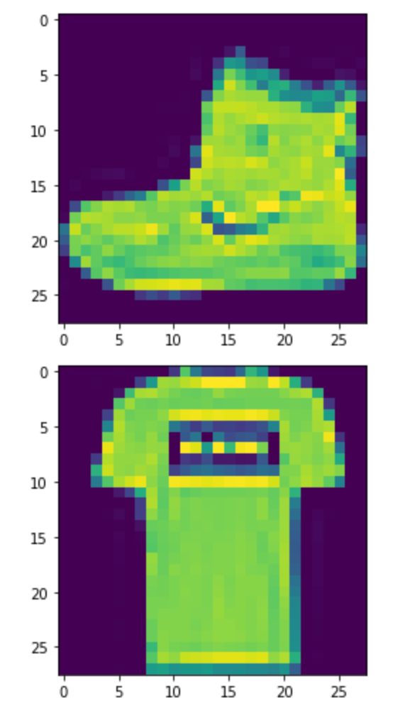
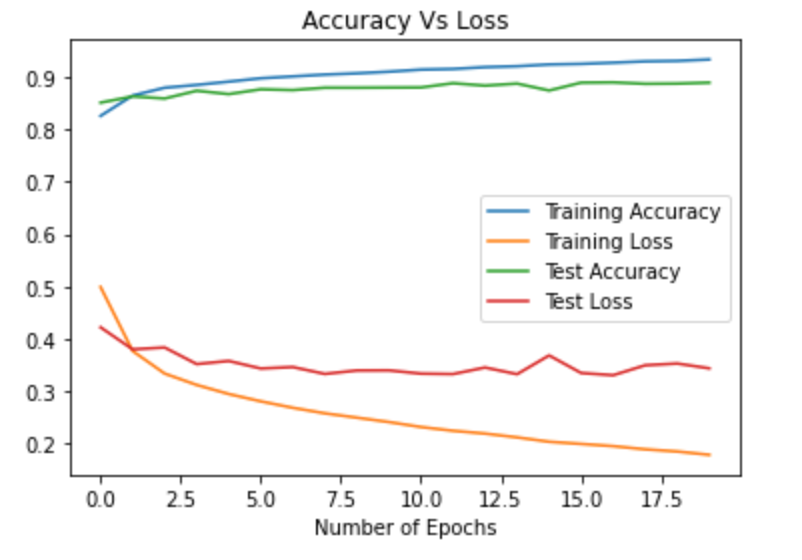

# MNIST-Fashion-Classification
Optimized a Simple Neural Network to Identify Articles of Clothing using the MNIST Dataset

## Overview

A simple neural network was created based on Part 2 of the tutorial ["ML Zero to Hero"](https://www.youtube.com/watch?v=bemDFpNooA8), posted on Youtube by the Tensorflow Youtube channel. The goal of this project was to optimize the [code](https://goo.gle/34cHkDk) from this tutorial as well as visualize the results of the model. The method of optimization was to increase the epochs from 5 to 20. As a result, the accuracy increased from 88% to 89%. This result illustrates that increasing the number of epochs does not necessarily result in improved performance. When graphing the loss and accuracy of the model, the training and testing accuracies are close to diverging near 20 epochs. If the the epochs were increased, the model would likely begin to overfit the training data and thereby significantly reduce the accuracy.

## Results

Here are two examples of what the images look like. Note that each article of clothing is centered and is the only object in the image.

Below is the loss and accuracy values between training and testing. Note that there is little increase in the testing accuracy as the number of epochs surpasses 5.

